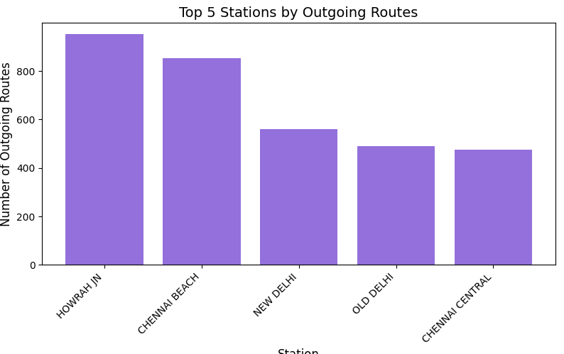
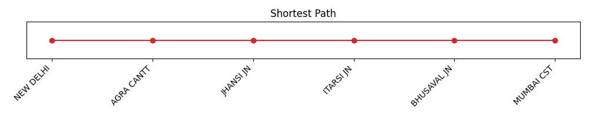
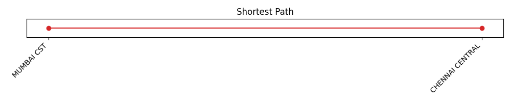
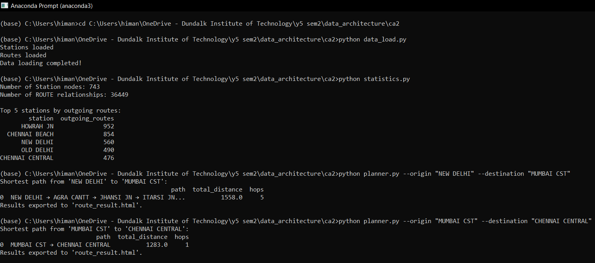
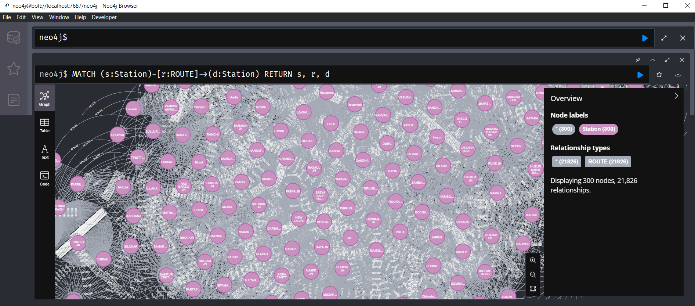
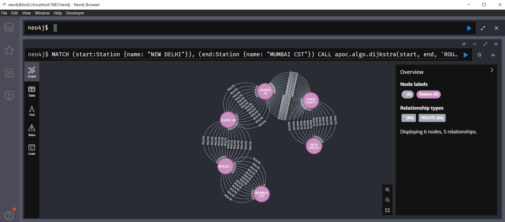

# 🚆 Public Transport Route Planner  

---

## 📋 Project Overview

This project is a Python-based route planning application utilizing Neo4j graph database technology to model and query the Indian Railways network. It provides users with functionalities such as loading train data into the graph database, exploring station statistics, and computing the shortest route between any two stations. The project demonstrates the power of graph databases for route optimization and network analysis in transport systems.

---

## 🛠️ Technologies Used

| Technology  | Purpose                                |
|-------------|--------------------------------------|
| 🐍 Python      | Scripting, querying Neo4j             |
| 🗄️ Neo4j       | Graph database for railway network    |
| 🐼 pandas      | Data manipulation                     |
| ⚙️ argparse    | Command-line argument parsing         |
| 📊 networkx    | Graph processing and visualization    |
| 🔌 Neo4j APOC  | Extended procedures for Neo4j queries |

---

## 📂 Dataset

- **Dataset:** `trains.csv` — Indian Railways train routes  
- **Source:** [Kaggle - Indian Trains Dataset](https://www.kaggle.com/datasets/dnyaneshyeole/indian-trains?select=trains.csv)  
- **Key Variables:**

  | Variable       | Description                         |
  |----------------|-----------------------------------|
  | 🚉 train_name     | Name or ID of the train            |
  | 🔢 train_number   | Unique train number                 |
  | 🚩 source        | Origin station                     |
  | 🏁 destination   | Final station                     |
  | 📏 distance      | Distance covered (in km)           |
  | ⏳ total_time    | Duration of journey                 |
  | 🕒 departure     | Departure time                     |
  | 🕓 arrival       | Arrival time                       |

---

## 📁 Files and Functionality

- **`data_load.py`**  
  Loads train route data from the CSV file into the Neo4j graph database.

- **`statistics.py`**  
  Provides key statistics of the database, including the total number of stations and routes (nodes and relationships), top 5 busiest stations by outgoing routes, and visualizes these busiest stations.  

  

- **`planner.py`**  
  Implements the route planner functionality. Users specify origin and destination stations, and it calculates the shortest route using graph algorithms. The output is both printed in the command line and saved as an HTML file (`route_result.html`). The route is also visualized for better comprehension.

    
  

---

## 💻 Command Line Outputs

- Output of running queries and scripts through the command line interface demonstrating dataset exploration, route planning, and Neo4j graph queries.

    
    
  

---

## ⚙️ Requirements

- **Operating System:** Windows 10 / 11  
- **Python Version:** 3.10+  
- **Python Packages:**  
  - pandas  
  - neo4j  
  - argparse  
  - networkx  
- **Neo4j:**  
  - Neo4j Desktop with APOC Plugin installed  

---

## 🚀 How to Run

1. **Setup Neo4j Database**  
   - Launch Neo4j Desktop  
   - Create a new project and a local database instance  
   - Update `AUTH = ("neo4j", "yourpassword")` in your Python scripts with your database password  

2. **Run the Scripts**  
   ```bash
   pip install pandas neo4j argparse networkx
   python data_load.py
   python statistics.py
   python planner.py --origin "NEW DELHI" --destination "MUMBAI CST"
